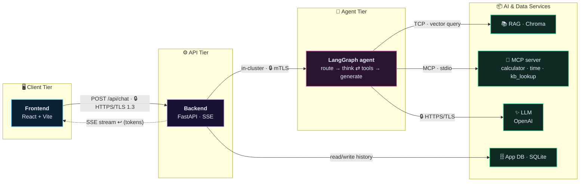

<div align="center">

🌐 **English** · [Português](README.pt-BR.md)

# 🧭 AI Agent Simulator

### Watch a chat message travel through a **real** AI agent — live, stage by stage.

#### 🗺️ **Harness Engineering** · 🔄 **Loop Engineering** — a hands-on lab for the two disciplines behind every AI agent.

### 🚀 [**Try the live demo →**](https://reginaldosilva27.github.io/AgentSimulator/)

No setup, no key — a mocked showcase that **replays real captured runs** for a set of sample
questions (Simple + Intermediate scenarios). For the full live tool (your own OpenAI key, file
uploads, everything real), run it locally — see [Quickstart](#-quickstart) below.

<br/>

An interactive, educational **X-ray of a modern agentic AI application**. You type a message; the
backend runs a real **LangGraph** agent (**RAG** → **MCP tools** → **LLM**) and emits every stage as
a stream of trace events; the frontend **animates those events** across a graph of "stations" and
lets you **click any one to inspect the real data** flowing through it. Nothing is mocked — the
reasoning, embeddings, vector store, relational DB and tool calls are all real.

More than a demo, it's a **gateway to two disciplines**: **Harness Engineering** (the *wiring* — the
tools, RAG, MCP, memory, context window and permissions the model is bolted to) and **Loop
Engineering** (the *cycle* — how the agent reasons, acts, observes and knows when to stop). The
canvas is the **map** (harness, in space); the animated run is the **journey** (loop, in time).

> Inspired by [Transformer Explainer](https://github.com/poloclub/transformer-explainer) — but a hands-on lab for **Harness & Loop Engineering**.

[](https://github.com/reginaldosilva27/AgentSimulator/actions/workflows/ci.yml)


<br/>

**[🪜 Maturity ladder](#-the-maturity-ladder--simple--intermediate--advanced) · [🎬 Replay](#-interactive-replay--the-timeline) · [🧭 Guided tour](#-guided-tour) · [⚡ Stream vs Batch](#-stream-vs-batch) · [📚 Chat with docs](#-conversation-with-your-documents-rag) · [🌍 Bilingual](#-bilingual---cloud-overlay) · [🧪 Experiments](#-experiment-live)**

</div>

---

## 🗺️🔄 Learn the two disciplines behind every AI agent

Modern LLM engineering climbs a ladder — **Prompt → Context → Harness → Loop**. The last two rungs
are where agents are actually won or lost, and they're invisible in most tutorials. This simulator
makes them **visible, side by side**:

| 🗺️ **Harness Engineering** — *the wiring (space)* | 🔄 **Loop Engineering** — *the cycle (time)* |
|---|---|
| Everything that isn't the model: tools, RAG, MCP, memory, the context window, guardrails, permissions. *"Agent = Model + Harness."* | How the agent repeats: **reason → act → observe**, when it stops, how it recovers from failure. *What separates a great agent from a mediocre one.* |
| See it as the **map** of stations you can click and inspect. | See it as the **journey** — step through every iteration, replay it, watch the ReAct loop turn. |

Flip the **Harness ⇄ Loop** lens in the app to light up one axis at a time — then read the full
theory in **[Learn mode](#-learn-mode)**. New to the terms? Start with
[🎓 What you'll learn](#-what-youll-learn).

---

## 📑 Table of contents

- [🗺️🔄 Harness & Loop Engineering](#-learn-the-two-disciplines-behind-every-ai-agent)

- [✨ Feature highlights](#-feature-highlights)
- [🔭 What it does](#-what-it-does)
- [🪜 The maturity ladder — Simple · Intermediate · Advanced](#-the-maturity-ladder--simple--intermediate--advanced)
- [🧠 Agent anatomy — open the box](#-agent-anatomy--open-the-box)
- [🎬 Interactive replay & the timeline](#-interactive-replay--the-timeline)
- [🧭 Guided tour](#-guided-tour)
- [⚡ Stream vs Batch](#-stream-vs-batch)
- [📚 Conversation with your documents (RAG)](#-conversation-with-your-documents-rag)
- [🧪 Experiment live](#-experiment-live)
- [🌍 Bilingual + ☁️ Cloud overlay](#-bilingual---cloud-overlay)
- [📚 Learn mode](#-learn-mode)
- [🎓 What you'll learn](#-what-youll-learn)
- [🏗️ Architecture](#️-architecture)
- [🌐 Network edge — the real ingress chain](#-network-edge--the-real-ingress-chain)
- [🚀 Quickstart](#-quickstart)
- [🔌 OpenAI-only](#-openai-only)
- [🧱 Tech stack](#-tech-stack)
- [📁 Project layout](#-project-layout)
- [🧪 How it's built — SDD + TDD](#-how-its-built--sdd--tdd)
- [🧑‍🤝‍🧑 How to collaborate on this project](#-how-to-collaborate-on-this-project)
- [🤝 Contributing & license](#-contributing--license)

---

## ✨ Feature highlights

<table>
<tr>
<td width="33%" valign="top">

### 🔭 Live agent X-ray
Every stage — route, retrieve, reason, tools, generate, respond — animates across the canvas. **Click any station** to see the real payload: embeddings, similarity scores, tool arguments, the assembled prompt, token usage & cost.

</td>
<td width="33%" valign="top">

### 🪜 Maturity ladder
Climb three rungs — **Simple → Intermediate → Advanced** — to see how a teaching demo grows into a production pipeline (rerankers, guardrails, gateway, eval & observability).

</td>
<td width="33%" valign="top">

### 🎬 Interactive replay
Play · pause · **step** · scrub the captured trace. Live streaming and step-replay run on the *exact same code path* — replay is just a smaller cursor.

</td>
</tr>
<tr>
<td width="33%" valign="top">

### 🧭 Guided tour
A narrated, hands-free walkthrough that stops at each phase, opens the right inspector, and explains what just happened — great for a first look.

</td>
<td width="33%" valign="top">

### ⚡ Stream vs Batch
Flip the delivery mode: **stream** (SSE, token-by-token, live) or **batch** (one JSON response, then replayed). See the latency trade-off for yourself.

</td>
<td width="33%" valign="top">

### 📚 Chat with your documents
📎 **Drop in your own PDF** and watch it get ingested live (chunk → embed → store), then ask questions grounded on it — a genuine **RAG** loop with cosine top-k retrieval and **visible scores**.

</td>
</tr>
<tr>
<td width="33%" valign="top">

### 🌍 Bilingual EN / PT
The entire UI, every label, blurb and tour caption ships in **English and Portuguese** — toggle the language at any time.

</td>
<td width="33%" valign="top">

### ☁️ Cloud overlay
The model is cloud-agnostic. Overlay **Azure · AWS · GCP** to map each tier/station to a concrete example service — without forking the app.

</td>
<td width="33%" valign="top">

### 🧪 Experiment live
Rewrite the **system prompt**, toggle individual **MCP tools**, and tune **RAG top-k** — per conversation — then watch how the run changes.

</td>
</tr>
</table>

---

## 🔭 What it does

You type a message. The app **animates the full request lifecycle** across a graph of "stations",
and lets you **click any station to inspect the real data** flowing through it:

| Station | Tier | What you see |
|---|---|---|
| **Frontend** | Client | The message leaving the browser over HTTPS — and the answer streaming back to it. |
| **Backend (API)** | API | FastAPI terminates TLS, opens an SSE stream, and relays every stage. Shows routes & protocols. |
| **Agent (LangGraph)** | Agent | The ReAct loop deciding whether to retrieve, call a tool, or answer — going back and forth. |
| **RAG pipeline** | Services | Query embedding → vector search in Chroma → top-k chunks **with similarity scores**. |
| **MCP tools** | Services | Tool discovery + the exact arguments and results of each tool call. |
| **LLM** | Services | The assembled prompt (system + context + tools), streamed tokens and **real token usage + cost**. |

The pipeline is drawn as **deployable tiers (containers)** — Client, API, Agent, and AI & Data
Services — that talk over the **network**, with each hop labeled by its protocol (`🔒 HTTPS/TLS`,
in-cluster mTLS, MCP/stdio, …), a public/private **zone**, and an example cloud service mapping.
You see the infrastructure, the hops, **and** the agent loop going back and forth.

### 🔬 Execution traces — observability that comes with the run

Every run also captures a **LangSmith-style span tree** — duration, tokens and cost per node —
so you can see *where the latency goes*: `think` vs `retrieve` vs `generate` vs the LLM call itself.
It's the same data a production observability stack gives you, surfaced inline.

<p align="center">
  
</p>

---

## 🪜 The maturity ladder — Simple · Intermediate · Advanced

Most demos stop at the **2023 agent** (ReAct + naïve RAG + MCP). Real systems add an AI-Ops axis —
evals, observability, guardrails, gateways, caching. Rather than cram all of that into one
unreadable diagram, the app is a **ladder you climb**: keep the simple, legible default, and let the
learner *climb* to see what each production concern adds and **why**.

| Rung | What it shows | Status |
|---|---|---|
| 🟢 **Simple** | The full app, **fully live**: ReAct loop + vector RAG + MCP tools, single-turn, in-request. Send a message and watch the real pipeline. **(default)** | ✅ Live |
| 🟡 **Intermediate** | The agent grows up into **DeepAgents** (explicit planning + sub-agents + a virtual file system for longer-horizon tasks); RAG-quality + honest cost: **reranker**, **hybrid search**, real token/cost accounting. | 🔜 Preview topology |
| 🔴 **Advanced** | **Multi-agent orchestration** — DeepAgents coordinating specialized sub-agents — plus "how agents live in production": **LLM gateway**, **guardrails in/out**, **semantic cache**, **eval runner**, **observability sink**. | 🔜 Preview topology |

The upper rungs render their extra stations as **explicit, visually-distinct "coming soon" preview
tiles** — the *target architecture* is itself a teaching artifact. Honesty first: nothing fakes a
run, so sending is disabled on a rung until its real nodes ship (each lands in its own spec).

> 📋 Every preview tile is catalogued in **[`docs/roadmap.md`](docs/roadmap.md)** with what it is,
> where it sits in the code, and what a spec would need to add — **pick one to contribute**.

The Agent node itself is **relabelled per rung** to mark this direction: `Agent` / `ReAct` on Simple
becomes **`DeepAgents`** on Intermediate and **`DeepAgents + Multi-agents`** on Advanced. Today this is
a frontend label only (same underlying station) — a visual reminder of where the ladder heads, not yet
a different runtime.

---

## 🧠 Agent anatomy — open the box

Click **Open full view** on the Agent station to drill into the **anatomy of one LLM round**: the
brain (model + ReAct loop), the **working memory** (tool calls #1/#2 with their args), the
**long-term memory** (prior conversation pairs) and a real **context-window budget** broken down
by category — system prompt, tool definitions, skills, memory, messages, completion — counted with
`tiktoken` to match the model's billing.

<p align="center">
  
</p>

---

## 🎬 Interactive replay & the timeline

Every run is captured as an ordered event log, so you never have to re-run anything to study it:

- **▶ Play / ⏸ Pause / ⏭ Step** through the trace at your own pace.
- **Scrub** the timeline to any moment; the canvas, the active hop, the streamed answer and the
  iteration count all re-derive from the cursor.
- A **phase rail** (request → memory → route → retrieve → reason → tools → generate → respond →
  persist) lets you jump straight to a phase.

> 💡 Live streaming and step/replay are the **exact same code path** — replay is just a smaller
> cursor over the same pure projection. What you replay is precisely what happened.

---

## 🧭 Guided tour

Hit **▶ Tour** for a narrated, hands-free walkthrough. It walks the timeline one phase at a time,
opens the right inspector for each, and captions what's happening:

> *"The browser sends your message to the API over HTTPS." → "RAG embeds the query and pulls the
> most relevant chunks." → "The agent reasons over the context and decides whether to call a tool."
> → "The model writes the answer, token by token."*

Pause, resume or stop at any point to take the wheel. (Bilingual — every caption ships in EN + PT.)

<p align="center">
  
</p>

---

## ⚡ Stream vs Batch

Toggle **how the backend delivers the result** and feel the difference:

| Mode | How it works | What you observe |
|---|---|---|
| ⚡ **Stream** *(default)* | Server-Sent Events — trace **and** answer arrive live, token by token. | The journey animates; the answer types out as the model writes it. |
| 📦 **Batch** | One JSON response after the run finishes; the client then replays it. | Time-to-first-byte vs. time-to-complete, made tangible. |

Both modes drive the **same** projection — the only difference is *when* the events arrive — so the
visualization is identical and the comparison is honest.

---

## 📚 Conversation with your documents (RAG)

Ask a question and the agent **reads documents to answer it** — a real retrieval loop, not a canned
lookup:

1. **Embed** your query (`text-embedding-3-small`).
2. **Search** the persistent **Chroma** vector store (cosine space) for the top-k most similar chunks.
3. **Rank** them with a transparent `similarity = 1 − distance` score you can inspect.
4. **Fold** the retrieved chunks into the prompt as grounded context for the LLM — and every saved
   message keeps the exact chunks it was grounded on.

### 📎 Bring your own PDF

Hit the **attach** button in the chat composer and **upload a PDF**. The ingestion isn't hidden — it
**streams over SSE so the canvas animates it**, stage by stage:

```text
📄 upload  →  ✂️ chunk  →  🧬 embed  →  🗄️ store (Chroma)   ← all live on the diagram
```

Uploaded docs are **scoped to the conversation** (appear as removable chips), so you can drop in a
paper or a contract and immediately chat with it. The built-in markdown corpus still lives in
[`backend/app/data/corpus/`](backend/app/data/corpus/) (`agents.md`, `rag.md`, `mcp.md`,
`embeddings.md`, `prompting.md`, `llm-basics.md`) — edit a file, re-run `python -m app.rag.ingest`,
and you're chatting with that too. Tune **top-k** live from the ⚙️ panel.

---

## 🧪 Experiment live

Open the ⚙️ **Settings** panel to turn the simulator into a sandbox — scoped **per conversation**,
prefilled from the backend so nothing is hardcoded:

- ✍️ **Rewrite the system prompt** — change the agent's persona/instructions and see the effect.
- 🔧 **Toggle MCP tools** — enable/disable `calculator`, `current_time`, `kb_lookup` individually;
  `mcp.discover` then honestly lists only what's enabled.
- 🎚️ **Tune RAG top-k** (1…8) — trade recall for focus and watch the retrieved set change.

An untouched panel reproduces the default behavior exactly.

### 🛠️ Configure the agent (Configure agent dialog)

Open **Configure agent** from the Agent node header to edit the agent like any other entity in the
catalog: identity, **two-layer prompt** (platform-wide *guardrails* + agent-specific *role*), model,
tools, knowledge base and skills. Agents are a real catalog — **shared across conversations**, so
editing one propagates everywhere it's used.

<p align="center">
  
</p>

---

## 🌍 Bilingual + ☁️ Cloud overlay

- **Two languages, everywhere** — the entire UI, every station blurb, hop label, Learn topic and
  tour caption ships in **English and Portuguese**. Toggle the language from the header at any time;
  new user-facing text is bilingual by rule.
- **Cloud-agnostic, with names on demand** — every tier/station/boundary carries a generic role
  *plus* a `{ azure, aws, gcp }` map of concrete example services. Switch the overlay to relabel the
  whole diagram with **Azure**, **AWS** or **GCP** services — no per-cloud fork.

---

## 📚 Learn mode

Click **📚 Learn** in the header for an interactive, roadmap.sh-style **content map**. It explains
the whole stack — architecture & layers, the software and Gen-AI concepts used (and *why*), security
at each layer, networking/infrastructure/containers, and where data lives — with a "what it is / why
it's used here / where in the project" breakdown for every topic.

<p align="center">
  
</p>

---

## 🎓 What you'll learn

- How a request becomes an **agent run**, and where the latency actually goes.
- How **RAG** retrieval works in practice (chunks, embeddings, cosine similarity, top-k).
- How **MCP** exposes tools to an agent and how tool calls are wired into the loop.
- How a **system prompt + retrieved context + tool results** are composed before the LLM call.
- How **tokens become cost**, and what changes between **stream** and **batch** delivery.
- What an agent needs to grow up: the **AI-Ops** concerns on the Intermediate/Advanced rungs.

---

## 🏗️ Architecture



The solid arrows are the request path; the dotted arrow is the answer **streaming back** over the
same SSE connection. There are **two databases on purpose**: the RAG *vector* store (Chroma) and a
*relational* application DB (SQLite) that is the transactional system of record and the agent's
**long-term memory**. See [`docs/architecture.md`](docs/architecture.md) and
[`docs/how-it-works.md`](docs/how-it-works.md) for the full walkthrough.

---

## 🌐 Network edge — the real ingress chain

<div align="center">
  
</div>

Production traffic never hits the backend directly — it crosses a chain of network
appliances first. The simulator runs that chain as **real Docker containers** (not
a drawing), so every request genuinely travels through each hop:

| Hop | Container | What it really does here |
|---|---|---|
| **DNS** | CoreDNS | Resolves the upstream service name |
| **CDN / cache** | Varnish | Browser-facing front door (`:8090`); reports cache **HIT / BYPASS** |
| **TLS / load balancer** | HAProxy | Terminates **TLS 1.3** (the single decryption point), load-balances |
| **WAF** | ModSecurity + OWASP CRS | Inspects every request; real attacks get a **403** |
| **API gateway** | Kong | Path routing + **real rate limiting** (a burst returns 429) |

Click the **frontend→backend** arrow (or any appliance) to inspect the real
evidence each hop adds — forwarded headers, cache status, LB pool/algorithm, WAF
paranoia level + anomaly threshold, gateway route + rate-limit policy — and watch a
**WAF block** light the path up with a 403 and an explanation of the matched rule.

> **Requires Docker.** The network edge only comes up via `docker compose up` (the
> appliances are containers). In local-dev mode (uvicorn + `npm run dev`) the
> frontend talks to the backend directly, without the chain.

---

## 🚀 Quickstart

### Option A — Docker (one command)

```bash
OPENAI_API_KEY=sk-... docker compose up --build
# Frontend: http://localhost:5173   Backend: http://localhost:8000/docs
```

This also brings up the **real [network edge](#-network-edge--the-real-ingress-chain)** —
DNS · CDN · WAF · TLS/LB · API gateway as containers — and the frontend talks to the
backend **through the chain** (`:8090`).

### Option B — Local dev

```bash
# Backend
cd backend
python -m venv .venv && source .venv/bin/activate
pip install -r requirements.txt
cp .env.example .env            # then add your OPENAI_API_KEY (required)
python -m app.rag.ingest        # build the local vector index
uvicorn app.main:app --reload --port 8000

# Frontend (new terminal)
cd frontend
npm install
npm run dev                     # http://localhost:5173
```

---

## 🔌 OpenAI-only

The app runs **only against OpenAI** — there is no demo/mock mode. An `OPENAI_API_KEY` is
**required**; with no key it fails fast at startup and `/api/chat` returns a clear error.

| | |
|---|---|
| API key | `OPENAI_API_KEY` **required** |
| LLM | `gpt-4o-mini` (streaming) |
| Embeddings | `text-embedding-3-small` |
| Cost | spends tokens (shown live on the LLM block) |

Set it in `backend/.env` (`OPENAI_API_KEY=sk-...`); the models are configurable via `LLM_MODEL`
and `EMBEDDING_MODEL`.

---

## 🧱 Tech stack

**Backend:** FastAPI · LangGraph · langchain-openai · langchain-mcp-adapters · Chroma · SQLite · sse-starlette
**Frontend:** React · Vite · TypeScript · React Flow · Framer Motion · Zustand · Tailwind CSS

---

## 📁 Project layout

```text
AgentSimulator/
├── backend/                      # FastAPI + LangGraph agent (Python 3.12)
│   ├── app/
│   │   ├── main.py               # FastAPI app: /api/chat (SSE) · /api/sessions · /api/.../documents (PDF upload) · /api/config · /api/health
│   │   ├── config.py             # pydantic-settings — OpenAI config (OPENAI_API_KEY required)
│   │   ├── schemas.py            # event protocol (TraceEvent, Stage, Phase) — the BE↔FE contract
│   │   ├── trace.py              # TraceEmitter (stage events) + in-memory TraceStore (replay)
│   │   ├── agent/                # the LangGraph state machine
│   │   │   ├── graph.py          # route → retrieve → think ⇄ tools → generate → respond
│   │   │   ├── state.py          # typed AgentState
│   │   │   └── prompts.py        # system prompt
│   │   ├── rag/                  # retrieval pipeline (chat-with-documents)
│   │   │   ├── ingest.py         # chunk + embed + build the Chroma index (markdown corpus)
│   │   │   ├── ingestion.py      # PDF upload → chunk → embed → store (streamed; animates the canvas)
│   │   │   ├── retriever.py      # embed query + cosine top-k search
│   │   │   ├── store.py          # Chroma vector store wiring
│   │   │   └── embeddings.py     # OpenAI embeddings
│   │   ├── db/store.py           # relational app DB (SQLite) — history + long-term memory
│   │   ├── mcp/                  # Model Context Protocol
│   │   │   ├── server.py         # FastMCP server: calculator, current_time, kb_lookup
│   │   │   └── client.py         # loads MCP tools into the agent (+ local fallback)
│   │   ├── llm/                  # provider abstraction (Strategy pattern)
│   │   │   ├── provider.py       # LLMProvider interface + factory (OpenAI, fail-fast)
│   │   │   └── openai_provider.py# real ChatOpenAI (streaming)
│   │   └── data/corpus/          # markdown knowledge base (RAG source + learning material)
│   ├── tests/                    # pytest — runs against OpenAI (structural assertions)
│   ├── Dockerfile
│   ├── requirements.txt
│   ├── pyproject.toml            # ruff + pytest config
│   └── .env.example
├── frontend/                     # React + Vite + TypeScript visualization
│   ├── src/
│   │   ├── App.tsx               # layout + Simulator / Learn page toggle + header controls
│   │   ├── components/
│   │   │   ├── FlowCanvas.tsx     # React Flow canvas (tiers, stations, hops)
│   │   │   ├── ChatPanel.tsx      # input + streamed answer
│   │   │   ├── InspectorPanel.tsx # per-station data, protocols, network hops
│   │   │   ├── Timeline.tsx       # play / pause / step / replay
│   │   │   ├── ScenarioToggle.tsx # the Simple/Intermediate/Advanced ladder switcher
│   │   │   ├── TourCaption.tsx     # guided-tour narration
│   │   │   ├── SettingsPanel.tsx   # ⚙️ live experiments (prompt / tools / top-k)
│   │   │   ├── nodes/             # StationNode, TierNode (container boxes)
│   │   │   └── edges/             # FlowEdge (animated, directional, labeled hops)
│   │   ├── learn/                # the "Learn" content map (roadmap.sh-style)
│   │   ├── store/useSimulator.ts # zustand event store (live + replay)
│   │   ├── lib/
│   │   │   ├── sse.ts             # fetch-based SSE client
│   │   │   ├── derive.ts          # pure view projection (events + cursor → state)
│   │   │   ├── scenario.ts        # maturity-ladder mode (global)
│   │   │   ├── settings.ts        # stream vs batch delivery mode
│   │   │   ├── experiment.ts      # per-conversation experiment overrides
│   │   │   ├── tour.ts            # guided-tour reducer
│   │   │   ├── phases.ts          # timeline phase rail
│   │   │   └── stations.ts        # tiers, stations, hops & cloud mapping (single source)
│   │   ├── i18n/                 # EN / PT translations
│   │   └── types/events.ts       # TypeScript mirror of the event protocol
│   ├── Dockerfile
│   ├── nginx.conf
│   ├── package.json
│   └── vite.config.ts
├── docs/                         # architecture.md · how-it-works.md · development-workflow.md · images/
├── specs/                        # spec-driven development — one folder per feature (NNN-…)
├── .specify/constitution.md      # project principles (the SDD/TDD constitution)
├── docker-compose.yml            # one-command full stack
├── .github/workflows/ci.yml      # lint (ruff) + tests (pytest) + frontend build
└── LICENSE                       # MIT
```

---

## 🧪 How it's built — SDD + TDD

This repo is developed **spec-first and test-first.** A new feature starts as a spec under
[`specs/`](specs/) (WHAT/WHY → plan → TDD task list), and behavior is driven by failing tests
(`red → green → refactor`). The non-negotiable principles live in
[`.specify/constitution.md`](.specify/constitution.md); the workflow is in
[`specs/README.md`](specs/README.md) and [`docs/development-workflow.md`](docs/development-workflow.md).
Bug fixes and small tweaks skip the spec but still ship with a test.

Each feature above has a numbered spec — e.g. the [maturity ladder](specs/008-scenario-framework/),
[guided tour](specs/005-guided-tour/), [live experiments](specs/006-interactive-experiments/),
[timeline phases](specs/004-timeline-phases/) and [token + cost](specs/011-token-cost/).

---

## 🧑‍🤝‍🧑 How to collaborate on this project

This is an open-source learning resource, and the whole point is that **everyone changing it follows
the same patterns** — the [constitution](.specify/constitution.md)'s non-negotiable principles
(protocol-as-contract, everything-is-real, bilingual EN/PT, every Stage maps to a station, SDD + TDD).
To make that easy — instead of memorizing the rules — the repo ships ready-made
[**Claude Code**](https://claude.com/claude-code) helpers under [`.claude/`](.claude/) (see
[`.claude/README.md`](.claude/README.md)). They're thin workflows that point at the canonical docs;
they don't restate the law.

> 💡 They load automatically when you open this repo in Claude Code. **Using OpenAI Codex instead?**
> The same standards are mirrored in [`AGENTS.md`](AGENTS.md) (always-on, the twin of `CLAUDE.md`) and
> [`.codex/prompts/`](.codex/prompts/) (the same workflows as `/slash` commands — see
> [`.codex/README.md`](.codex/README.md)). Using neither? The `.claude/` and `.codex/` files double as a
> plain Markdown checklist of what every change must satisfy.

### 🛠️ Skills — run one to *do* a task the right way

Type `/skill-name` in Claude Code (or just describe the task and it picks the skill).

| Skill | Use it when | What it keeps you from breaking |
|---|---|---|
| **`new-spec`** | Starting a new feature, behavior change, new Stage, or new station/tier — **before any code** | The spec-first rule (§10). Scaffolds `specs/NNN-*/` from the template and walks WHAT/WHY → plan → TDD tasks |
| **`add-stage`** | Adding or changing a pipeline `Stage`/`Phase`/`TraceEvent` | The ~7 load-bearing places a Stage touches (`schemas.py` ↔ `events.ts`, the emit, `STAGE_TO_STATION`, `STAGE_TO_PHASE`, `readoutFor`, `renderDetail`) — several `tsc` does **not** catch |
| **`add-mcp-tool`** | Adding a new agent-callable MCP tool | The dual-registration gotcha (`mcp/server.py` `@mcp.tool` **and** the `_load_local` mirror in `client.py`) + the "no faking" honesty rule |
| **`add-db-table`** | Any schema change to the relational SQLite store | Keeping `_SCHEMA`, [`docs/data-model.md`](docs/data-model.md), the schema-audit test, the clear-databases coverage, and the `user_version` migration in sync |
| **`verify-gates`** | Before you call anything done / open a PR | Runs the local mirror of CI (`ruff` · `pytest` · `tsc` · Vitest) **plus** the cross-cutting constitution gates, and reports what's red |

### 🔍 Agents — spawn one to *review* (read-only, they never edit)

Ask Claude Code to "review with the `frontend-reviewer` agent" (or it'll delegate on its own).

| Agent | What it audits |
|---|---|
| **`protocol-guardian`** | `schemas.py` ↔ `events.ts` parity, and that every `Stage` is wired through `STAGE_TO_STATION`, `STAGE_TO_PHASE`, `readoutFor` and `renderDetail` |
| **`backend-reviewer`** | Async correctness, the trace-emitter pattern, dependency-injection-not-globals, MCP dual-registration, schema sync, structural tests |
| **`frontend-reviewer`** | The pure-projection rule (live == replay), geometry/content separation, exhaustive `StationId`/`Stage` switches, cloud overlay, clean types |
| **`ai-engineering-reviewer`** | Honesty (real vs preview, nothing faked), the bounded ReAct loop, honest tool-elected retrieval, prompt layering, RAG correctness |
| **`i18n-auditor`** | EN/PT parity — flags any user-facing string that ships in only one language (§4) |

### ✅ Recommended flow for a contribution

1. **Plan** → run **`new-spec`** and resolve the open questions before writing code.
2. **Build** → drive it red→green→refactor; reach for **`add-stage`** / **`add-mcp-tool`** / **`add-db-table`** for those specific changes.
3. **Self-review** → spawn the domain reviewer for the area you touched, plus **`protocol-guardian`** and **`i18n-auditor`**.
4. **Verify** → run **`verify-gates`**; open the PR only when it's all green.

This mirrors exactly what CI ([`.github/workflows/ci.yml`](.github/workflows/ci.yml)) enforces, so a green local run means a green PR.

---

## 🤝 Contributing & license

PRs and issues welcome — this is a learning resource. Please follow the
[SDD + TDD workflow](docs/development-workflow.md) above. Licensed under [MIT](LICENSE).

**Looking for something to build?** Start with **[`docs/roadmap.md`](docs/roadmap.md)** — the
contributor TODO list of every unimplemented Intermediate / Advanced node (DeepAgents,
multi-agent orchestration, LLM gateway / model router, guardrails, semantic cache, eval runner,
observability sink) plus cross-cutting seams (multi-provider support, auth, multi-replica). Each
item links the code seam and sketches the spec it needs.
</content>
</invoke>
