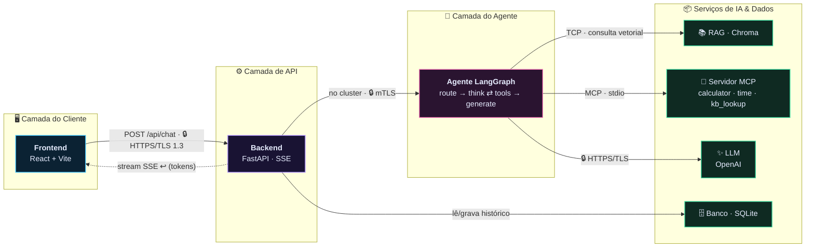

<div align="center">

🌐 [English](README.md) · **Português**

# 🧭 AI Agent Simulator

### Veja uma mensagem de chat atravessar um agente de IA **real** — ao vivo, etapa por etapa.

#### 🗺️ **Harness Engineering** · 🔄 **Loop Engineering** — um laboratório prático das duas disciplinas por trás de todo agente de IA.

### 🚀 [**Testar a demo ao vivo →**](https://reginaldosilva27.github.io/AgentSimulator/)

Sem instalar nada, sem chave — uma demonstração mockada que **reproduz execuções reais capturadas**
para um conjunto de perguntas de exemplo (cenários Simple + Intermediate). Para a ferramenta completa
ao vivo (sua própria chave OpenAI, upload de arquivos, tudo real), rode localmente — veja o
[Início rápido](#-início-rápido) abaixo.

<br/>

Um **raio-X interativo e educativo de uma aplicação agêntica de IA moderna**. Você digita uma
mensagem; o backend roda um agente **LangGraph** de verdade (**RAG** → **ferramentas MCP** →
**LLM**) e emite cada etapa como um fluxo de eventos de trace; o frontend **anima esses eventos**
por um grafo de "estações" e deixa você **clicar em qualquer uma para inspecionar os dados reais**
que passam por ela. Nada é simulado — o raciocínio, os embeddings, o vector store, o banco
relacional e as chamadas de ferramentas são todos reais.

Mais que uma demo, é uma **porta de entrada para duas disciplinas**: **Harness Engineering** (o
*cabeamento* — as ferramentas, o RAG, o MCP, a memória, a janela de contexto e as permissões às
quais o modelo está preso) e **Loop Engineering** (o *ciclo* — como o agente raciocina, age, observa
e sabe a hora de parar). O canvas é o **mapa** (harness, no espaço); a execução animada é a
**jornada** (loop, no tempo).

> Inspirado no [Transformer Explainer](https://github.com/poloclub/transformer-explainer) — mas um laboratório prático de **Harness & Loop Engineering**.

[](https://github.com/reginaldosilva27/AgentSimulator/actions/workflows/ci.yml)


<br/>

**[🪜 Escada de maturidade](#-a-escada-de-maturidade--simples--intermediário--avançado) · [🎬 Replay](#-replay-interativo--a-linha-do-tempo) · [🧭 Tour guiado](#-tour-guiado) · [⚡ Stream vs Batch](#-stream-vs-batch) · [📚 Conversa com docs](#-conversa-com-seus-documentos-rag) · [🌍 Bilíngue](#-bilíngue---camada-de-nuvem) · [🧪 Experimentos](#-experimente-ao-vivo)**

</div>

---

## 🗺️🔄 Aprenda as duas disciplinas por trás de todo agente de IA

A engenharia de LLM moderna sobe uma escada — **Prompt → Context → Harness → Loop**. Os dois últimos
degraus são onde os agentes são de fato ganhos ou perdidos, e são invisíveis na maioria dos
tutoriais. Este simulador os torna **visíveis, lado a lado**:

| 🗺️ **Harness Engineering** — *o cabeamento (espaço)* | 🔄 **Loop Engineering** — *o ciclo (tempo)* |
|---|---|
| Tudo que não é o modelo: ferramentas, RAG, MCP, memória, a janela de contexto, guardrails, permissões. *"Agent = Model + Harness."* | Como o agente repete: **raciocina → age → observa**, quando ele para, como se recupera de falhas. *O que separa um agente ótimo de um medíocre.* |
| Veja como o **mapa** de estações em que você clica e inspeciona. | Veja como a **jornada** — avance por cada iteração, dê replay, veja o loop ReAct girar. |

Alterne a lente **Harness ⇄ Loop** no app para acender um eixo por vez — depois leia a teoria
completa no **[Modo Learn](#-modo-learn)**. Novo nos termos? Comece por
[🎓 O que você vai aprender](#-o-que-você-vai-aprender).

---

## 📑 Sumário

- [🗺️🔄 Harness & Loop Engineering](#-aprenda-as-duas-disciplinas-por-trás-de-todo-agente-de-ia)
- [✨ Destaques](#-destaques)
- [🔭 O que ele faz](#-o-que-ele-faz)
- [🪜 A escada de maturidade — Simples · Intermediário · Avançado](#-a-escada-de-maturidade--simples--intermediário--avançado)
- [🧠 Anatomia do agente — abra a caixa](#-anatomia-do-agente--abra-a-caixa)
- [🎬 Replay interativo & a linha do tempo](#-replay-interativo--a-linha-do-tempo)
- [🧭 Tour guiado](#-tour-guiado)
- [⚡ Stream vs Batch](#-stream-vs-batch)
- [📚 Conversa com seus documentos (RAG)](#-conversa-com-seus-documentos-rag)
- [🧪 Experimente ao vivo](#-experimente-ao-vivo)
- [🌍 Bilíngue + ☁️ Camada de nuvem](#-bilíngue---camada-de-nuvem)
- [📚 Modo Learn](#-modo-learn)
- [🎓 O que você vai aprender](#-o-que-você-vai-aprender)
- [🏗️ Arquitetura](#️-arquitetura)
- [🌐 Borda de rede — a cadeia real de entrada](#-borda-de-rede--a-cadeia-real-de-entrada)
- [🏟️ Arena — o laboratório de capacidade](#️-arena--o-laboratório-de-capacidade)
- [🚀 Início rápido](#-início-rápido)
- [🔌 Somente OpenAI](#-somente-openai)
- [🧱 Stack de tecnologia](#-stack-de-tecnologia)
- [📁 Organização do projeto](#-organização-do-projeto)
- [🧩 Entenda o código (grafo de conhecimento)](#-entenda-o-código-grafo-de-conhecimento)
- [🧪 Como é construído — SDD + TDD](#-como-é-construído--sdd--tdd)
- [🧑‍🤝‍🧑 Como colaborar com este projeto](#-como-colaborar-com-este-projeto)
- [🤝 Contribuição & licença](#-contribuição--licença)

---

## ✨ Destaques

<table>
<tr>
<td width="33%" valign="top">

### 🔭 Raio-X do agente ao vivo
Cada etapa — rotear, recuperar, raciocinar, ferramentas, gerar, responder — anima no canvas. **Clique em qualquer estação** para ver o payload real: embeddings, scores de similaridade, argumentos das ferramentas, o prompt montado, uso de tokens & custo.

</td>
<td width="33%" valign="top">

### 🪜 Escada de maturidade
Suba três degraus — **Simples → Intermediário → Avançado** — para ver como uma demo didática vira um pipeline de produção (rerankers, guardrails, gateway, eval & observabilidade).

</td>
<td width="33%" valign="top">

### 🎬 Replay interativo
Play · pause · **passo** · navegue pelo trace capturado. O streaming ao vivo e o replay passo-a-passo rodam pelo *exato mesmo caminho de código* — replay é só um cursor menor.

</td>
</tr>
<tr>
<td width="33%" valign="top">

### 🧭 Tour guiado
Um passeio narrado e sem as mãos que para em cada fase, abre o inspetor certo e explica o que acabou de acontecer — ótimo para o primeiro contato.

</td>
<td width="33%" valign="top">

### ⚡ Stream vs Batch
Troque o modo de entrega: **stream** (SSE, token a token, ao vivo) ou **batch** (uma resposta JSON, depois reproduzida). Sinta o trade-off de latência na prática.

</td>
<td width="33%" valign="top">

### 📚 Converse com seus documentos
📎 **Solte um PDF seu** e veja ele ser ingerido ao vivo (chunk → embed → store), depois faça perguntas embasadas nele — um **RAG** de verdade, com busca top-k por cosseno e **scores visíveis**.

</td>
</tr>
<tr>
<td width="33%" valign="top">

### 🌍 Bilíngue EN / PT
Toda a interface, cada rótulo, descrição e legenda do tour vem em **inglês e português** — troque o idioma a qualquer momento.

</td>
<td width="33%" valign="top">

### ☁️ Camada de nuvem
O modelo é agnóstico de nuvem. Sobreponha **Azure · AWS · GCP** para mapear cada camada/estação a um serviço de exemplo concreto — sem bifurcar o app.

</td>
<td width="33%" valign="top">

### 🧪 Experimente ao vivo
Reescreva o **system prompt**, ligue/desligue **ferramentas MCP** e ajuste o **top-k do RAG** — por conversa — e veja como a execução muda.

</td>
</tr>
</table>

---

## 🔭 O que ele faz

Você digita uma mensagem. O app **anima todo o ciclo de vida da requisição** por um grafo de
"estações" e deixa você **clicar em qualquer estação para inspecionar os dados reais** que passam
por ela:

| Estação | Camada | O que você vê |
|---|---|---|
| **Frontend** | Cliente | A mensagem saindo do navegador via HTTPS — e a resposta voltando em streaming. |
| **Backend (API)** | API | O FastAPI encerra o TLS, abre um stream SSE e repassa cada etapa. Mostra rotas & protocolos. |
| **Agente (LangGraph)** | Agente | O loop ReAct decidindo se recupera, chama uma ferramenta ou responde — indo e voltando. |
| **Pipeline RAG** | Serviços | Embedding da query → busca vetorial no Chroma → chunks top-k **com scores de similaridade**. |
| **Ferramentas MCP** | Serviços | Descoberta de ferramentas + os argumentos e resultados exatos de cada chamada. |
| **LLM** | Serviços | O prompt montado (sistema + contexto + ferramentas), tokens em streaming e **uso real de tokens + custo**. |

O pipeline é desenhado como **camadas implantáveis (contêineres)** — Cliente, API, Agente e Serviços
de IA & Dados — que conversam pela **rede**, com cada salto rotulado pelo seu protocolo
(`🔒 HTTPS/TLS`, mTLS interno ao cluster, MCP/stdio, …), uma **zona** pública/privada e um mapeamento
de serviço de nuvem de exemplo. Você vê a infraestrutura, os saltos **e** o loop do agente indo e
voltando.

### 🔬 Traces de execução — observabilidade que vem junto com a execução

Cada execução também captura uma **árvore de spans no estilo LangSmith** — duração, tokens e custo
por nó — para você ver *para onde vai a latência*: `think` vs `retrieve` vs `generate` vs a chamada
ao LLM em si. É o mesmo dado que uma stack de observabilidade de produção te dá, exibido inline.

<p align="center">
  
</p>

---

## 🪜 A escada de maturidade — Simples · Intermediário · Avançado

A maioria das demos para no **agente de 2023** (ReAct + RAG ingênuo + MCP). Sistemas reais adicionam
um eixo de AI-Ops — evals, observabilidade, guardrails, gateways, cache. Em vez de espremer tudo
isso num único diagrama ilegível, o app é uma **escada que você sobe**: mantém o padrão simples e
legível, e deixa quem está aprendendo *subir* para ver o que cada preocupação de produção adiciona e
**por quê**.

| Degrau | O que mostra | Status |
|---|---|---|
| 🟢 **Simples** | O app completo, **totalmente ao vivo**: loop ReAct + RAG vetorial + ferramentas MCP, turno único, na requisição. Envie uma mensagem e veja o pipeline real. **(padrão)** | ✅ Ao vivo |
| 🟡 **Intermediário** | O agente amadurece e vira **DeepAgents** (planejamento explícito + subagentes + um sistema de arquivos virtual para tarefas de horizonte mais longo); qualidade de RAG + custo honesto: **reranker**, **busca híbrida**, contabilidade real de token/custo. | 🔜 Topologia de prévia |
| 🔴 **Avançado** | **Orquestração multi-agente** — DeepAgents coordenando subagentes especializados — mais "como agentes vivem em produção": **gateway de LLM**, **guardrails de entrada/saída**, **cache semântico**, **eval runner**, **sink de observabilidade**. | 🔜 Topologia de prévia |

Os degraus superiores renderizam suas estações extras como **blocos de prévia "em breve",
explicitamente distintos visualmente** — a *arquitetura-alvo* é, em si, um artefato didático.
Honestidade em primeiro lugar: nada finge uma execução, então o envio fica desativado num degrau até
seus nós reais existirem (cada um chega em sua própria spec).

> 📋 Todo bloco de prévia está catalogado em **[`docs/roadmap.md`](docs/roadmap.md)** com o que é,
> onde fica no código e o que uma spec precisaria adicionar — **escolha um para contribuir**.

O próprio nó do Agente é **renomeado por degrau** para marcar essa direção: `Agent` / `ReAct` no
Simples vira **`DeepAgents`** no Intermediário e **`DeepAgents + Multiagentes`** no Avançado. Hoje isso
é só um rótulo no frontend (a estação por baixo é a mesma) — um lembrete visual de para onde a escada
aponta, ainda não um runtime diferente.

---

## 🧠 Anatomia do agente — abra a caixa

Clique em **Abrir vista completa** na estação Agent para mergulhar na **anatomia de um round do LLM**:
o cérebro (modelo + loop ReAct), a **memória de trabalho** (chamadas de ferramenta #1/#2 com seus
argumentos), a **memória de longo prazo** (pares anteriores da conversa) e um **orçamento real da
janela de contexto** dividido por categoria — system prompt, definições de ferramentas, skills,
memória, mensagens, resposta — contado com `tiktoken` para casar com a cobrança do modelo.

<p align="center">
  
</p>

---

## 🎬 Replay interativo & a linha do tempo

Toda execução é capturada como um log ordenado de eventos, então você nunca precisa re-executar nada
para estudá-la:

- **▶ Play / ⏸ Pause / ⏭ Passo** pelo trace no seu próprio ritmo.
- **Navegue** pela linha do tempo até qualquer instante; o canvas, o salto ativo, a resposta em
  streaming e a contagem de iterações são todos rederivados a partir do cursor.
- Uma **trilha de fases** (requisição → memória → rotear → recuperar → raciocinar → ferramentas →
  gerar → responder → persistir) deixa você pular direto para uma fase.

> 💡 O streaming ao vivo e o passo/replay são o **exato mesmo caminho de código** — replay é só um
> cursor menor sobre a mesma projeção pura. O que você reproduz é precisamente o que aconteceu.

---

## 🧭 Tour guiado

Aperte **▶ Tour** para um passeio narrado e sem as mãos. Ele percorre a linha do tempo uma fase por
vez, abre o inspetor certo para cada uma e legenda o que está acontecendo:

> *"O navegador envia sua mensagem para a API via HTTPS." → "O RAG faz o embedding da query e puxa
> os chunks mais relevantes." → "O agente raciocina sobre o contexto e decide se chama uma
> ferramenta." → "O modelo escreve a resposta, token a token."*

Pause, retome ou pare a qualquer momento para assumir o controle. (Bilíngue — cada legenda vem em
EN + PT.)

<p align="center">
  
</p>

---

## ⚡ Stream vs Batch

Alterne **como o backend entrega o resultado** e sinta a diferença:

| Modo | Como funciona | O que você observa |
|---|---|---|
| ⚡ **Stream** *(padrão)* | Server-Sent Events — trace **e** resposta chegam ao vivo, token a token. | A jornada anima; a resposta vai sendo digitada conforme o modelo escreve. |
| 📦 **Batch** | Uma resposta JSON depois que a execução termina; o cliente então a reproduz. | Tempo até o primeiro byte vs. tempo até completar, de forma tangível. |

Os dois modos dirigem a **mesma** projeção — a única diferença é *quando* os eventos chegam — então
a visualização é idêntica e a comparação é honesta.

---

## 📚 Conversa com seus documentos (RAG)

Faça uma pergunta e o agente **lê documentos para respondê-la** — um loop de recuperação de verdade,
não uma consulta enlatada:

1. **Embeda** sua query (`text-embedding-3-small`).
2. **Busca** no vector store **Chroma** persistente (espaço de cosseno) os chunks top-k mais similares.
3. **Ranqueia** com um score transparente `similaridade = 1 − distância` que você pode inspecionar.
4. **Dobra** os chunks recuperados no prompt como contexto embasado para o LLM — e cada mensagem
   salva guarda exatamente os chunks em que se baseou.

### 📎 Traga seu próprio PDF

Aperte o botão de **anexar** no compositor do chat e **faça upload de um PDF**. A ingestão não é
escondida — ela **transmite via SSE para o canvas animá-la**, etapa por etapa:

```text
📄 upload  →  ✂️ chunk  →  🧬 embed  →  🗄️ store (Chroma)   ← tudo ao vivo no diagrama
```

Os documentos enviados têm **escopo na conversa** (aparecem como chips removíveis), então você pode
soltar um artigo ou um contrato e conversar com ele na hora. O corpus markdown embutido continua em
[`backend/app/data/corpus/`](backend/app/data/corpus/) (`agents.md`, `rag.md`, `mcp.md`,
`embeddings.md`, `prompting.md`, `llm-basics.md`) — edite um arquivo, rode `python -m app.rag.ingest`
de novo e você estará conversando com ele também. Ajuste o **top-k** ao vivo pelo painel ⚙️.

---

## 🧪 Experimente ao vivo

Abra o painel ⚙️ **Configurações** para transformar o simulador num sandbox — com escopo **por
conversa**, pré-preenchido a partir do backend para nada ficar fixado no código:

- ✍️ **Reescreva o system prompt** — mude a persona/instruções do agente e veja o efeito.
- 🔧 **Ligue/desligue ferramentas MCP** — habilite/desabilite `calculator`, `current_time`,
  `kb_lookup` individualmente; o `mcp.discover` então lista honestamente só o que está habilitado.
- 🎚️ **Ajuste o top-k do RAG** (1…8) — troque recall por foco e veja o conjunto recuperado mudar.

Um painel intocado reproduz exatamente o comportamento padrão.

### 🛠️ Configure o agente (diálogo Configure agent)

Abra **Configurar agente** no cabeçalho do nó Agent para editar o agente como qualquer outra entidade
no catálogo: identidade, **prompt em duas camadas** (*guardrails* da plataforma + *role* específico
do agente), modelo, ferramentas, base de conhecimento e skills. Os agentes são um catálogo de verdade
— **compartilhados entre conversas**, então editar um propaga para todos os lugares em que ele é usado.

<p align="center">
  
</p>

---

## 🌍 Bilíngue + ☁️ Camada de nuvem

- **Dois idiomas, em todo lugar** — toda a interface, cada descrição de estação, rótulo de salto,
  tópico do Learn e legenda do tour vem em **inglês e português**. Troque o idioma pelo cabeçalho a
  qualquer momento; todo texto novo voltado ao usuário é bilíngue por regra.
- **Agnóstico de nuvem, com nomes sob demanda** — cada camada/estação/fronteira carrega um papel
  genérico *mais* um mapa `{ azure, aws, gcp }` de serviços de exemplo concretos. Troque a sobreposição
  para re-rotular o diagrama inteiro com serviços **Azure**, **AWS** ou **GCP** — sem bifurcar por nuvem.

---

## 📚 Modo Learn

Clique em **📚 Learn** no cabeçalho para um **mapa de conteúdo** interativo no estilo roadmap.sh. Ele
explica toda a stack — arquitetura & camadas, os conceitos de software e de IA Generativa usados (e
*por quê*), segurança em cada camada, redes/infraestrutura/contêineres e onde os dados vivem — com um
detalhamento "o que é / por que é usado aqui / onde no projeto" para cada tópico.

<p align="center">
  
</p>

---

## 🎓 O que você vai aprender

- Como uma requisição vira uma **execução de agente**, e para onde a latência realmente vai.
- Como a recuperação **RAG** funciona na prática (chunks, embeddings, similaridade por cosseno, top-k).
- Como o **MCP** expõe ferramentas a um agente e como as chamadas se encaixam no loop.
- Como um **system prompt + contexto recuperado + resultados de ferramentas** são compostos antes da
  chamada ao LLM.
- Como **tokens viram custo**, e o que muda entre entrega **stream** e **batch**.
- O que um agente precisa para amadurecer: as preocupações de **AI-Ops** nos degraus
  Intermediário/Avançado.

---

## 🏗️ Arquitetura



As setas sólidas são o caminho da requisição; a seta pontilhada é a resposta **voltando em streaming**
pela mesma conexão SSE. Há **dois bancos de dados de propósito**: o vector store do RAG (Chroma) e um
banco de aplicação *relacional* (SQLite) que é o sistema transacional de registro e a **memória de
longo prazo** do agente. Veja [`docs/architecture.md`](docs/architecture.md) e
[`docs/how-it-works.md`](docs/how-it-works.md) para o passo a passo completo.

---

## 🌐 Borda de rede — a cadeia real de entrada

<div align="center">
  
</div>

Tráfego de produção nunca chega direto no backend — ele cruza uma cadeia de
appliances de rede primeiro. O simulador roda essa cadeia como **containers Docker
reais** (não um desenho), então cada requisição realmente passa por cada hop:

| Hop | Container | O que ele de fato faz aqui |
|---|---|---|
| **DNS** | CoreDNS | Resolve o nome do serviço upstream |
| **CDN / cache** | Varnish | Porta de entrada do navegador (`:8090`); reporta cache **HIT / BYPASS** |
| **TLS / balanceador** | HAProxy | Termina **TLS 1.3** (o único ponto de descriptografia), balanceia carga |
| **WAF** | ModSecurity + OWASP CRS | Inspeciona toda requisição; ataques reais levam **403** |
| **API gateway** | Kong | Roteamento por path + **rate limit real** (uma rajada devolve 429) |

Clique na seta **frontend→backend** (ou em qualquer appliance) para inspecionar a
evidência real que cada hop adiciona — headers encaminhados, status de cache,
pool/algoritmo do LB, nível de paranoia + threshold de anomalia do WAF, rota +
política de rate limit do gateway — e veja um **bloqueio do WAF** acender o caminho
com um 403 e a explicação da regra que casou.

> **Requer Docker.** A borda de rede só sobe via `docker compose up` (os appliances
> são containers). No modo dev local (uvicorn + `npm run dev`) o frontend fala com o
> backend diretamente, sem a cadeia.

---

## 🏟️ Arena — o laboratório de capacidade

O Simulador mostra **como uma requisição flui**. A **Arena** mostra **o que acontece
em escala.** É uma página separada (botão ao lado do **Learn**) onde você **arrasta
caixas de componentes para um canvas, conecta-as, despeja uma população de usuários
sobre o desenho e vê um modelo ao vivo dizer onde ele quebra** — qual caixa satura
primeiro, a latência ponta a ponta do turno e a conta do LLM.

> **O que é — e o que não é.** A Arena é um **modelo analítico** (constituição §3),
> *não* um teste de carga real. Ela nunca envia tráfego a lugar nenhum e não emite
> **nenhum evento de trace** — é só frontend e salva no `localStorage` do navegador.
> Os números são **benchmarks didáticos** de ordem de grandeza (as cifras do LLM são
> ancoradas nas tabelas públicas de cota do Azure OpenAI). O objetivo não é prever um
> sistema real na casa decimal — é tornar os **gargalos relativos legíveis**,
> principalmente que o LLM com rate limit é o muro que um agente bate muito antes dos
> bancos de dados.

### Para que usar

- **Criar intuição sobre gargalos de agente** — veja você mesmo por que a camada de
  LLM (centenas de chamadas/s por bloco de cota, segundos por chamada) limita um
  agente muito antes do vector DB ou do banco relacional.
- **Raciocinar sobre escala antes de construir** — experimente escala vertical vs
  horizontal, adicione um cache ou um AI gateway, espalhe uma frota por regiões e veja
  os números se moverem.
- **Ensinar & apresentar** — oito cenários de exemplo prontos e um banner de honestidade
  persistente fazem dela um laboratório prático para uma palestra, um workshop ou
  onboarding.

### Como usar

1. **Abra a Arena** — clique em **Arena** no cabeçalho (um desenho de amostra carrega
   na primeira visita), ou escolha um dos **Exemplos** no dropdown.
2. **Defina a carga** — arraste o slider de **usuários** e escolha um **think time**; a
   barra converte para req/s pela **Lei de Little** (`usuários ÷ think time`) e mostra a
   conversão — *100 mil usuários* e *100 mil req/s* diferem por ordens de grandeza.
3. **Componha a arquitetura** — arraste os tipos da paleta, conecte as caixas arrastando
   entre os handles (elas dão snap; uma caixa nova auto-conecta à selecionada) e apague
   uma aresta com **Backspace**. Use **auto-arrange** para reorganizar o grafo por
   profundidade.
4. **Escale & ajuste** — escolha o **tamanho da instância** (vertical) e a **quantidade
   de réplicas** (horizontal) de cada caixa; defina o fan-out de **chamadas por
   requisição** no LLM/tools; ajuste o **payload da carga** (tokens de entrada/saída) que
   move capacidade, latência e custo.
5. **Leia o resultado** — cada caixa mostra **QPS · utilização · latência · status**; o
   **gargalo** é destacado, uma caixa acima da capacidade reporta uma **taxa de descarte
   429** honesta, e o cabeçalho mostra a **latência ponta a ponta do turno** e a **conta
   do LLM**.

### O que o modelo captura

| Conceito | O que ensina |
|---|---|
| **Lei de Little** | Usuários + think time → req/s ofertado; um **equilíbrio de malha fechada** auto-regula a taxa quando a latência represa a população (demandado vs efetivo). |
| **Saturação honesta** | Caixas acima da capacidade descartam carga (429s) em vez de forjar uma latência; perto da saturação fica vermelho porque a curva de fila já é catastrófica. |
| **Fan-out do ReAct** | Um multiplicador de **chamadas por requisição** modela as 2–5 chamadas ao modelo que um turno real faz; uma caixa **Agent Harness** sempre presente torna esse fan-out visível sem mudar nenhum número. |
| **Cota de LLM, não CPU** | Unidades de LLM são **deployments com cota de tokens** (TPM ÷ formato da chamada), não containers; pools **na mesma região dividem a cota regional**, e hops entre regiões somam latência. |
| **Imposto de roteamento** | Um backend ligado **direto** a N deployments de LLM perde capacidade no roteamento client-side; inserir um **AI gateway** / load balancer devolve essa capacidade e agrega a frota. |
| **As duas contas do LLM** | **Provisionado** (capacidade reservada, cobrada mesmo ociosa) + **uso** (só chamadas atendidas — 429s não são cobrados). |
| **O muro de conexões** | Streams em voo (throughput × tempo-no-sistema) vs um orçamento de conexões por nó — o limite que de fato derruba backends de agente primeiro. |
| **Caches** | Um cache chave-valor (caminho de dados) ou um **cache semântico** (caminho do modelo) repassa adiante apenas a fração de miss. |

A paleta abrange as **estações agênticas** (client · backend · LLM · Vector DB · MCP ·
App DB) mais as **primitivas clássicas de escala** (CDN · API gateway · AI gateway ·
load balancer · cache · cache semântico · fila · réplica de leitura). Desenhos,
anotações e a carga atual persistem localmente, e a página inteira é **bilíngue EN /
PT**.

---

## 🚀 Início rápido

### Opção A — Docker (um comando)

```bash
OPENAI_API_KEY=sk-... docker compose up --build
# Frontend: http://localhost:5173   Backend: http://localhost:8000/docs
```

Isso também sobe a **[borda de rede](#-borda-de-rede--a-cadeia-real-de-entrada)** real —
DNS · CDN · WAF · TLS/LB · API gateway como containers — e o frontend fala com o
backend **através da cadeia** (`:8090`).

### Opção B — Dev local

```bash
# Backend
cd backend
python -m venv .venv && source .venv/bin/activate
pip install -r requirements.txt
cp .env.example .env            # depois adicione sua OPENAI_API_KEY (obrigatória)
python -m app.rag.ingest        # constrói o índice vetorial local
uvicorn app.main:app --reload --port 8000

# Frontend (novo terminal)
cd frontend
npm install
npm run dev                     # http://localhost:5173
```

---

## 🔌 Somente OpenAI

O app roda **somente contra a OpenAI** — não há modo demo/mock. Uma `OPENAI_API_KEY` é
**obrigatória**; sem chave ele falha rápido na inicialização e o `/api/chat` retorna um erro claro.

| | |
|---|---|
| Chave de API | `OPENAI_API_KEY` **obrigatória** |
| LLM | `gpt-4o-mini` (streaming) |
| Embeddings | `text-embedding-3-small` |
| Custo | gasta tokens (mostrado ao vivo no bloco do LLM) |

Defina em `backend/.env` (`OPENAI_API_KEY=sk-...`); os modelos são configuráveis via `LLM_MODEL`
e `EMBEDDING_MODEL`.

---

## 🧱 Stack de tecnologia

**Backend:** FastAPI · LangGraph · langchain-openai · langchain-mcp-adapters · Chroma · SQLite · sse-starlette
**Frontend:** React · Vite · TypeScript · React Flow · Framer Motion · Zustand · Tailwind CSS

---

## 📁 Organização do projeto

```text
AgentSimulator/
├── backend/                      # Agente FastAPI + LangGraph (Python 3.12)
│   ├── app/
│   │   ├── main.py               # App FastAPI: /api/chat (SSE) · /api/sessions · /api/.../documents (upload de PDF) · /api/config · /api/health
│   │   ├── config.py             # pydantic-settings — config da OpenAI (OPENAI_API_KEY obrigatória)
│   │   ├── schemas.py            # protocolo de eventos (TraceEvent, Stage, Phase) — o contrato BE↔FE
│   │   ├── trace.py              # TraceEmitter (eventos de etapa) + TraceStore em memória (replay)
│   │   ├── agent/                # a máquina de estados do LangGraph
│   │   │   ├── graph.py          # route → retrieve → think ⇄ tools → generate → respond
│   │   │   ├── state.py          # AgentState tipado
│   │   │   └── prompts.py        # system prompt
│   │   ├── rag/                  # pipeline de recuperação (conversa-com-documentos)
│   │   │   ├── ingest.py         # chunk + embed + constrói o índice Chroma (corpus markdown)
│   │   │   ├── ingestion.py      # upload de PDF → chunk → embed → store (em streaming; anima o canvas)
│   │   │   ├── retriever.py      # embeda a query + busca top-k por cosseno
│   │   │   ├── store.py          # ligação com o vector store Chroma
│   │   │   └── embeddings.py     # embeddings da OpenAI
│   │   ├── db/store.py           # banco de aplicação relacional (SQLite) — histórico + memória de longo prazo
│   │   ├── mcp/                  # Model Context Protocol
│   │   │   ├── server.py         # servidor FastMCP: calculator, current_time, kb_lookup
│   │   │   └── client.py         # carrega as ferramentas MCP no agente (+ fallback local)
│   │   ├── llm/                  # abstração de provider (padrão Strategy)
│   │   │   ├── provider.py       # interface LLMProvider + factory (OpenAI, falha-rápido)
│   │   │   └── openai_provider.py# ChatOpenAI real (streaming)
│   │   └── data/corpus/          # base de conhecimento em markdown (fonte do RAG + material didático)
│   ├── tests/                    # pytest — roda contra a OpenAI (asserções estruturais)
│   ├── Dockerfile
│   ├── requirements.txt
│   ├── pyproject.toml            # config do ruff + pytest
│   └── .env.example
├── frontend/                     # visualização React + Vite + TypeScript
│   ├── src/
│   │   ├── App.tsx               # layout + alternância Simulator / Learn + controles do cabeçalho
│   │   ├── components/
│   │   │   ├── FlowCanvas.tsx     # canvas React Flow (camadas, estações, saltos)
│   │   │   ├── ChatPanel.tsx      # entrada + resposta em streaming
│   │   │   ├── InspectorPanel.tsx # dados por estação, protocolos, saltos de rede
│   │   │   ├── Timeline.tsx       # play / pause / passo / replay
│   │   │   ├── ScenarioToggle.tsx # o seletor da escada Simples/Intermediário/Avançado
│   │   │   ├── TourCaption.tsx     # narração do tour guiado
│   │   │   ├── SettingsPanel.tsx   # ⚙️ experimentos ao vivo (prompt / ferramentas / top-k)
│   │   │   ├── nodes/             # StationNode, TierNode (caixas dos contêineres)
│   │   │   └── edges/             # FlowEdge (saltos animados, direcionais, rotulados)
│   │   ├── learn/                # o mapa de conteúdo "Learn" (estilo roadmap.sh)
│   │   ├── store/useSimulator.ts # store zustand de eventos (ao vivo + replay)
│   │   ├── lib/
│   │   │   ├── sse.ts             # cliente SSE baseado em fetch
│   │   │   ├── derive.ts          # projeção pura da view (eventos + cursor → estado)
│   │   │   ├── scenario.ts        # modo escada de maturidade (global)
│   │   │   ├── settings.ts        # modo de entrega stream vs batch
│   │   │   ├── experiment.ts      # overrides de experimento por conversa
│   │   │   ├── tour.ts            # reducer do tour guiado
│   │   │   ├── phases.ts          # trilha de fases da linha do tempo
│   │   │   └── stations.ts        # camadas, estações, saltos & mapa de nuvem (fonte única)
│   │   ├── i18n/                 # traduções EN / PT
│   │   └── types/events.ts       # espelho TypeScript do protocolo de eventos
│   ├── Dockerfile
│   ├── nginx.conf
│   ├── package.json
│   └── vite.config.ts
├── docs/                         # architecture.md · how-it-works.md · development-workflow.md · images/
├── specs/                        # desenvolvimento orientado a spec — uma pasta por feature (NNN-…)
├── .specify/constitution.md      # princípios do projeto (a constituição SDD/TDD)
├── docker-compose.yml            # stack completa em um comando
├── .github/workflows/ci.yml      # lint (ruff) + testes (pytest) + build do frontend
└── LICENSE                       # MIT
```

---

## 🧩 Entenda o código (grafo de conhecimento)

Este repositório já vem com um **grafo de conhecimento do
[Understand-Anything](https://github.com/Egonex-AI/Understand-Anything) pré-construído** — um mapa
interativo da arquitetura (558 nós / 1091 arestas, 10 camadas, um tour guiado de 14 passos). **A
análise já está feita e versionada**, então o time pode explorar **sem precisar re-escanear nada**.

**O que está versionado** (em [`.understand-anything/`](.understand-anything/)):

| Arquivo | O que é |
|---|---|
| `knowledge-graph.json` | O grafo completo — nós, arestas, camadas, tour (é o que o dashboard lê) |
| `meta.json` / `fingerprints.json` | Hash do commit + fingerprints por arquivo, para futuras execuções atualizarem **só o que mudou** |
| `config.json` / `.understandignore` | Idioma de saída + o escopo (este grafo cobre o código de `backend/` + `frontend/`) |

Há também um retrato estático para leitura rápida: **[`docs/ONBOARDING.md`](docs/ONBOARDING.md)**.

### ▶️ Ver o grafo na sua máquina — sem escanear

Tudo o que o dashboard precisa já está no repositório; você só instala o plugin uma vez e aponta o
dashboard dele para o grafo versionado.

1. **Instale o plugin** (no Claude Code):
   ```text
   /plugin marketplace add Egonex-AI/Understand-Anything
   /plugin install understand-anything
   /reload-plugins
   ```
2. **Build único** — o dashboard do plugin precisa de Node ≥ 22 + pnpm. Se faltar `pnpm`:
   ```bash
   npm install -g pnpm@10        # o corepack de um Node antigo (nvm) pode falhar na verificação de chaves; este caminho é o confiável
   ```
   (A primeira execução do `/understand-dashboard` compila o core do plugin automaticamente.)
3. **Abra o dashboard** — ele lê o `knowledge-graph.json` versionado, **não** re-escaneia:
   ```text
   /understand-anything:understand-dashboard
   ```
   Abra a URL `http://127.0.0.1:5173/?token=…` impressa (mantenha o `?token=`).

Prefere o terminal? Estes também usam o grafo existente sem escanear:
`/understand-anything:understand-chat` (faça perguntas), `/understand-anything:understand-explain <arquivo>`
(mergulho em um arquivo), `/understand-anything:understand-onboard` (regera o guia de onboarding).

### 🔄 Manter atualizado (incremental — ainda sem re-escanear tudo)

Depois de dar `pull` em novos commits, atualize o grafo com uma execução **incremental** — graças ao
`fingerprints.json` versionado, ela só re-analisa os arquivos que mudaram desde a última análise:

```text
/understand-anything:understand
```

Use `/understand-anything:understand --full` só quando quiser reconstruir do zero (ex.: depois de
ampliar o escopo em `.understand-anything/.understandignore`).

---

## 🧪 Como é construído — SDD + TDD

Este repositório é desenvolvido **spec-first e test-first.** Uma nova feature começa como uma spec em
[`specs/`](specs/) (O QUE/POR QUÊ → plano → lista de tarefas TDD), e o comportamento é dirigido por
testes que falham (`red → green → refactor`). Os princípios inegociáveis vivem em
[`.specify/constitution.md`](.specify/constitution.md); o fluxo está em
[`specs/README.md`](specs/README.md) e [`docs/development-workflow.md`](docs/development-workflow.md).
Correções de bug e pequenos ajustes pulam a spec mas ainda vêm com um teste.

Cada feature acima tem uma spec numerada — por exemplo a [escada de maturidade](specs/008-scenario-framework/),
o [tour guiado](specs/005-guided-tour/), os [experimentos ao vivo](specs/006-interactive-experiments/),
as [fases da linha do tempo](specs/004-timeline-phases/) e [token + custo](specs/011-token-cost/).

---

## 🧑‍🤝‍🧑 Como colaborar com este projeto

Isto é um recurso de aprendizado open-source, e a ideia toda é que **todo mundo que mexe aqui siga os
mesmos padrões** — os princípios inegociáveis da [constituição](.specify/constitution.md)
(protocolo-é-o-contrato, tudo-é-real, bilíngue EN/PT, todo Stage mapeia para uma estação, SDD + TDD).
Para facilitar isso — em vez de decorar as regras — o repositório já vem com auxiliares prontos do
[**Claude Code**](https://claude.com/claude-code) em [`.claude/`](.claude/) (veja
[`.claude/README.md`](.claude/README.md)). São fluxos finos que apontam para a documentação canônica;
não reescrevem a lei.

> 💡 Eles carregam automaticamente quando você abre este repo no Claude Code. **Usa o OpenAI Codex?**
> Os mesmos padrões estão espelhados em [`AGENTS.md`](AGENTS.md) (sempre-ativo, o gêmeo do `CLAUDE.md`)
> e em [`.codex/prompts/`](.codex/prompts/) (os mesmos fluxos como comandos `/slash` — veja
> [`.codex/README.md`](.codex/README.md)). Não usa nenhum dos dois? Os arquivos em `.claude/` e `.codex/`
> também servem como um checklist puro em Markdown do que toda mudança precisa cumprir.

### 🛠️ Skills — execute uma para *fazer* a tarefa do jeito certo

Digite `/nome-da-skill` no Claude Code (ou só descreva a tarefa e ele escolhe a skill).

| Skill | Use quando | O que ela impede você de quebrar |
|---|---|---|
| **`new-spec`** | Começar uma nova feature, mudança de comportamento, novo Stage ou nova estação/tier — **antes de qualquer código** | A regra spec-first (§10). Cria `specs/NNN-*/` a partir do template e conduz O QUE/POR QUÊ → plano → tarefas TDD |
| **`add-stage`** | Adicionar ou alterar um `Stage`/`Phase`/`TraceEvent` do pipeline | Os ~7 lugares carga-pesada que um Stage toca (`schemas.py` ↔ `events.ts`, a emissão, `STAGE_TO_STATION`, `STAGE_TO_PHASE`, `readoutFor`, `renderDetail`) — vários que o `tsc` **não** pega |
| **`add-mcp-tool`** | Adicionar uma nova ferramenta MCP que o agente pode chamar | O gotcha da dupla-registração (`mcp/server.py` `@mcp.tool` **e** o espelho `_load_local` em `client.py`) + a regra de honestidade "nada é falso" |
| **`add-db-table`** | Qualquer mudança de schema no banco relacional SQLite | Manter `_SCHEMA`, [`docs/data-model.md`](docs/data-model.md), o teste de schema-audit, a cobertura do limpar-bancos e a migração `user_version` em sincronia |
| **`verify-gates`** | Antes de dar algo como pronto / abrir um PR | Roda o espelho local do CI (`ruff` · `pytest` · `tsc` · Vitest) **mais** os gates transversais da constituição, e reporta o que está vermelho |

### 🔍 Agents — invoque um para *revisar* (somente leitura, nunca editam)

Peça ao Claude Code para "revisar com o agente `frontend-reviewer`" (ou ele delega sozinho).

| Agent | O que ele audita |
|---|---|
| **`protocol-guardian`** | Paridade `schemas.py` ↔ `events.ts`, e que todo `Stage` está ligado via `STAGE_TO_STATION`, `STAGE_TO_PHASE`, `readoutFor` e `renderDetail` |
| **`backend-reviewer`** | Correção do async, o padrão do trace-emitter, injeção-de-dependência-não-globais, dupla-registração MCP, sincronia de schema, testes estruturais |
| **`frontend-reviewer`** | A regra de projeção-pura (live == replay), separação geometria/conteúdo, switches exaustivos de `StationId`/`Stage`, cloud overlay, tipos limpos |
| **`ai-engineering-reviewer`** | Honestidade (real vs preview, nada falsificado), o loop ReAct limitado, retrieval honesto eleito por tool, camadas de prompt, correção do RAG |
| **`i18n-auditor`** | Paridade EN/PT — sinaliza qualquer string visível ao usuário que veio em só um idioma (§4) |

### ✅ Fluxo recomendado para uma contribuição

1. **Planeje** → rode **`new-spec`** e resolva as perguntas em aberto antes de escrever código.
2. **Construa** → conduza red→green→refactor; use **`add-stage`** / **`add-mcp-tool`** / **`add-db-table`** para essas mudanças específicas.
3. **Auto-revise** → invoque o reviewer do domínio que você tocou, mais **`protocol-guardian`** e **`i18n-auditor`**.
4. **Verifique** → rode **`verify-gates`**; abra o PR só quando estiver tudo verde.

Isso espelha exatamente o que o CI ([`.github/workflows/ci.yml`](.github/workflows/ci.yml)) exige, então uma rodada local verde significa um PR verde.

---

## 🤝 Contribuição & licença

PRs e issues são bem-vindos — isto é um recurso de aprendizado. Por favor siga o
[fluxo SDD + TDD](docs/development-workflow.md) acima. Licenciado sob [MIT](LICENSE).

**Procurando algo para construir?** Comece por **[`docs/roadmap.md`](docs/roadmap.md)** — a lista
de TODO para colaboradores com cada nó Intermediário / Avançado ainda não implementado (DeepAgents,
orquestração multi-agente, gateway de LLM / roteador de modelos, guardrails, cache semântico, eval
runner, sink de observabilidade) mais costuras transversais (suporte a multi-provider, autenticação,
multi-réplica). Cada item aponta a costura no código e esboça a spec que ele precisa.
</content>
